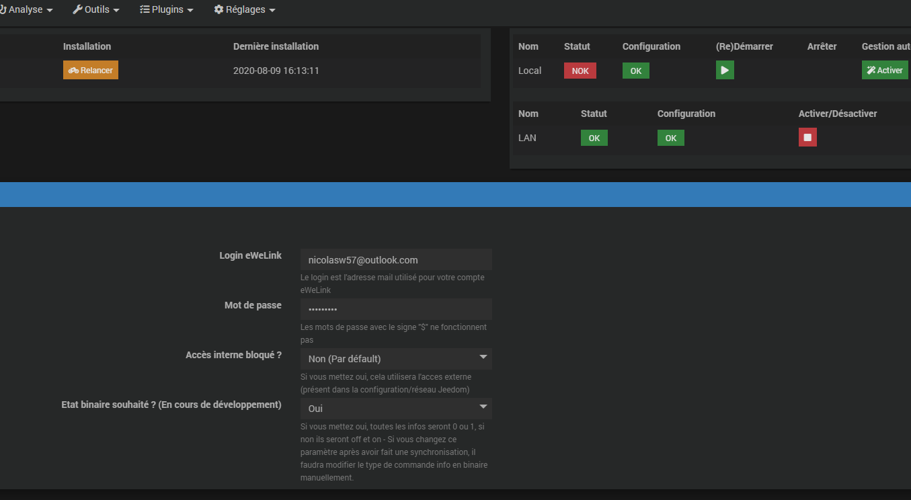

eWeJee
==============================

Description
-----------

This plugin is intended to integrate with Jeedom ALL your eWeLink compatible devices without flashing.
Thanks to a synchronization button, just a click and all your devicesa re imported into your Jeedom.

Configuration
-------------

Plugin configuration
========================

a.  Installation / Creating

> **Tip**
>
> In order to use the plugin, you must download, install and
> Activate it like any Jeedom plugin.

After that you will arrive on this page:

On this page you have little to do. It is strongly recommended that you start installing dependencies (even if they appear OK) and wait 5 minutes before launching the daemon.
In the meantime you can enter your login and password of the eWeLink application.

> **Important**
>
> It is imperative to wait 5 minutes after starting the installation of dependencies AND having saved your credentials to launch the daemon. 

The plugin
=========

Go to the connected objects menu to find the plugin.

On this page, you just need to click the little more above to synchronize to synchronize all the devices of the eWeLink application.

Une fois que c'est fait vous devez rafraîchir la page et vous verrez apparaître tous les équipements.

Gestion
==========

Dans la partie gestion vous avez :
-	Synchroniser : Ce bouton sert à synchroniser tous les équipements de l'application eWeLink.
> **Important**
>	ATTENTION IL FAUT SUPPRIMER TOUT LES EQUIPEMENTS AVANT DE LANCER UNE SYNCHRONISATION !
-	Configuration : Pour voir la configuration du plugin…

Mes ewejees
=============

Affiche tous vos équipements.
1 ewejee correspond à un équipement (intérrupteur, prise etc…)

Configuration d’un ewejee
=============

Vous avez 2 onglets.

Dans l’onglet équipement vous retrouver : 

- Le nom de l’équipement.
- L'objet parents .
- La catégorie.
- Une case de commentaire.

> **Important**
> Le nom de l’équipement ne doit pas être changé il doit correspondre au nom que vous avez dans l’application.
> La case de commentaire peut-être utilisé comme vous le souhaitez, cela vous permet de mettre un commentaire à votre équipement.

Interrupteur / relais / prises
----------------------
Vous avez une commande action par « band » qui effectue un on s’il est éteint et un off s’il est allumé et un équipement info qui vous indique s'il est allumé ou éteint.
Pour l'instant la mise a jour ne se fait que si ont appuie sur une commande action.
Une mise a jour de l’état automatique sera mis en place plus tard.

Pour les relais utilisé en "contact sec", l'état de change pas car celui-ci envoi un "push" sur le relai.

Si vous avez une équippement qui n'est pas reconnu, vous aurez par défaut 4 channel et 4 etat, biensur si vous n'avez qu'un channel vous pouvez supprimer tous les autres.

Ifan
--------------

A suivre…

Compatibilitée
=========

Ce plugin est à ces débuts et pour pouvoir ajouter des équipements qui ne sont pas prévus, ou qui ne fonctionnent pas, il faut m'envoyer le fichier sync.json qui se trouve dans le dossier plugins/ewejee/core/js/sync.json
> **Important**
>	Ce fichier contient toutes les données que eWeLink posède, soit votre IP publique, l'apikey etc... 
>   Je n'ai pas besoin de ces informations presonnels, donc vous pouvez ouvrir ce fichier avec un éditeur de texte pour supprimer ces données.

Vous pouvez l'envoyer à l'adresse mail suivrante : wn68320@gmail.com

Je pourrais alors adapter le code afin de le rendre compatible.

Si vous avez des questions, surtout n'hésitez pas à me contacter, le mieux est par mail que je consulte régulèrement.

Changelog
=========

Changelog détaillé :
<https://github.com/jeedom/plugin-ewejee/commits/master>

Liste des équipements compatibles
=================================

<https://jeedom.github.io/documentation/#equipment>
