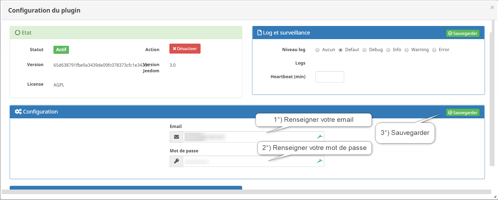
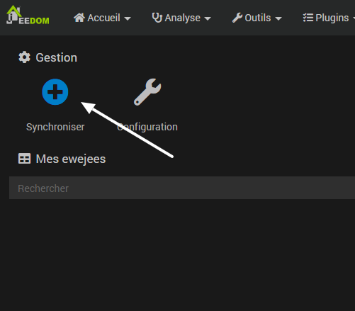

eWeJee
==============================

### <i class="far fa-exclamation-triangle"></i> MAJ V1.1 (Beta) ###

# Attention, si vous passer à la version V1.1 il faut faire l'instalation des dependances (Attendre 5 à 10 minutes), supprimer tous vos equipements et refaire une synchronisation !
# Dans cet ordre precis !

Description
-----------

Ce plugin à pour but d’intégrer à Jeedom TOUT vos équipements compatible eWeLink sans les flasher.
Grace à un bouton de synchronisation, un clic et tout vous équipements sont importé dans Jeedom.

> **Info**
>
> Le pugin passe par le cloud eWeLink

> **IMPORTANT**
> 
> eWeLink n'accepte qu'une seul connexion par compte, donc dès que vous lancer le plugin, cela va déconnecter votre smartphone.
> Pour palier à cela, il est conseillé de faire une compte eWeLink pour Jeedom, vous pouvez partager vos équipements entre compte
> eWeLink.

Configuration
-------------

Configuration du plugin
========================

a.  Installation/Création

> **Tip**
>
> Afin d’utiliser le plugin, vous devez le télécharger, l’installer et
> l’activer comme tout plugin Jeedom.

Suite à cela vous arriverez sur cette page :

Sur cette page vous devez rentrez votre login et mot de passe de l’application eWeLink.
Sauvgardez et cliquez sur verifier la connexion.

> **Important**
>
> Il faut impérativement attendre 5 minutes après avoir lancé l'installation des dépendances.

Si vous avez le méssage "Echec d'authentification, veillez vérifier vos identifiants" : 

- Le mot de passe ne peut pas contenir de signe "$".
- Vérifiez vos identifants, le login doit etre l'adresse mail utilisé dans l'aplication eWeLink.
- Si vos identifiants sont correct, vérifiez que le démon est bien lancé et que les dépendances sont "OK".
- Regardez les log "eWeJee_node" dans la section "Logs et surveillance", les dernières lignes vous indique l'érreur, si vous ne la comprenez pas, contactez moi sur community ou GitHub.

Le plugin
=========

Rendez vous dans le menu Plugins &gt; objets connectés pour retrouver le plugin.

Sur cette page, il vous suffit maintenant de cliquer sur le petit plus au-dessus de synchroniser pour synchroniser tous les équipements de l'application eWeLink.

Une fois que c'est fait si vous ne voyez pas les équipements, recharger la page (CTRL + F5).

Gestion
==========

Dans la partie gestion vous avez :
-	Synchroniser : Ce bouton sert à synchroniser tous les équipements de l'application eWeLink.
> **Info**
> 
>	Une détection des equipements déjà connus à été ajouté, donc plus besoin de tout supprimer.
>	Si vous avez un equipement à acutaliser, supprimer le.
-	Configuration : Pour voir la configuration du plugin…

Mes ewejees
=============

Affiche tous vos équipements.
1 ewejee correspond à un équipement (intérrupteur, prise etc…)

Configuration d’un ewejee
=============

Vous avez 2 onglets.

Dans l’onglet équipement vous retrouver : 

- Le nom de l’équipement.
- L'objet parent.
- La catégorie.
- Une case de commentaire.

> **Important**
> 
> Le nom de l’équipement ne doit pas être changé il doit correspondre au nom que vous avez dans l’application.
> La case de commentaire peut-être utilisé comme vous le souhaitez, cela vous permet de mettre un commentaire à votre équipement.

Interrupteur / relais / prises
----------------------
Vous avez une commande action par « band » (Channel, cannal) qui effectue un "on" s’il est éteint et un "off" s’il est allumé et un équipement info qui vous indique s'il est allumé ou éteint.
Vous avez plusieurs moyens de metre à jour les commandes info : 

- La mise a jour se fait automatiquement dès qu'un changement d'état est éffectué (même en allumant un interrupteur sans passer par l'appli ou le plugin par exemple)
- Une mise à jour automatique est prévu toute les heures.
- Pour les relais utilisé en "contact sec", l'état de change pas car celui-ci envoi un "push" sur le relai.

> **Info**
> 
> Il est normal de voir plusieurs channel et etat même si votre equipement n'a qu'un channel, car dans la synchronisation 
> on récupère tous les paramètres et sonoff a 4 paramètres, et ceci même pour les equipements qui n'en ont qu'un seul.
> Vous pouvez suprimmer ceux qui sont en trop, sauf si le nom est "Ne pas suppr.", dans ce cas cet équipement est obligatoire pour le fonctionnement, vous pouvez décocher la case "Afficher" pour l'enlever.

Commandes 
----------

- Nom : Le nom de ton équipement (Modifiable).
- Type : Le type de commande.
- Options : Permet d'afficher ou de cacher la commande, et d'historiser les commandes info.
- Unitée : Permet de mettre une unitée (°C, %...).
- Action : Acces à la configuration de la commande, ou du test.

Compatibilitée
=========

Le plugin est fait de façon a être compatible avec la majorité des équipements.
Une adaptation doit être faites pour certains équipements, comme par exemple l'ifan.

Voici la liste des équipements compatible à 100% :

Sonoff : 
=======

- [x] ifan02/ifan03
- [x] RF Bridge (beta)
- [x] TH10/TH16
- [x] Basic R2
- [x] Basic R3
- [x] Dual R2
- [x] Mini
- [x] POWR2
- [x] 4CHR2/PROR2
- [x] IW100/101
- [x] TX SWITCH
- [x] S20
- [x] S26
- [x] S31
- [x] S55
- [ ] 433 RF Bridge (J'ai besoin de bêta testeur)
- [x] Relais DIY

Si votre "equipement n'est pas dans la liste, cela ne veut pas dire qu'il ne sera pas supporté par le plugin, cette liste est celle des équipements testé.

Si vous remarque qu'un de vos équipements n'est pas fonctionnel ou ne fonctionne pas correctement, vous pouvez me contacter sur GitHub (de préférence).

Changelog
=========

Changelog détaillé :
<https://github.com/foulek57/jeedom-ewejee/blob/master/docs/fr_FR/changelog.md>
